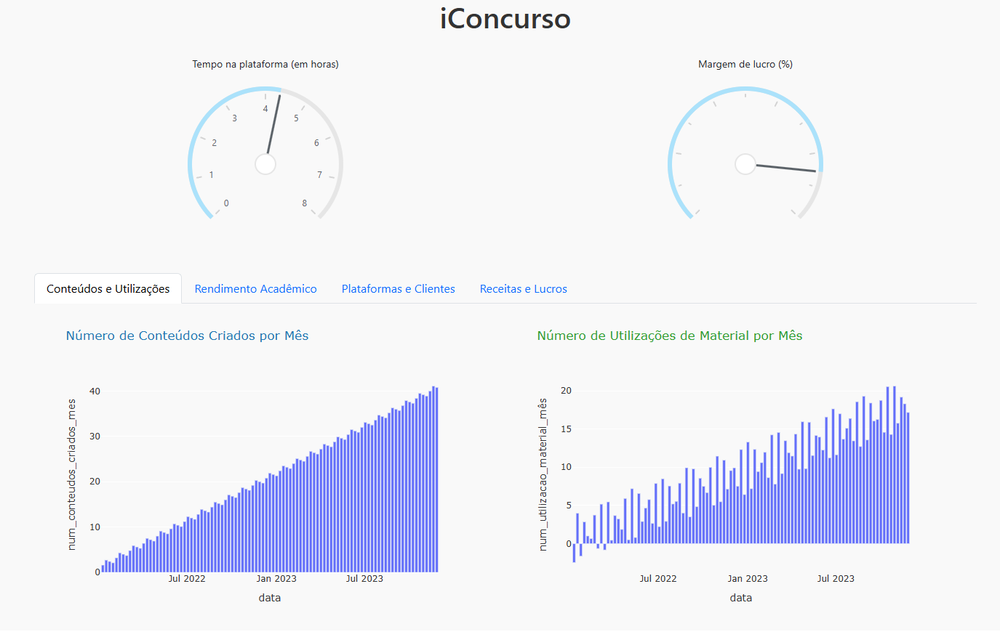

# Dashboard _iConcurso
Dashboard criado para o projeto de inovação tecnológica

## Ferramentas adotadas
Foram usadas apenas as bibliotecas Pandas, Numpy e Dash.

## Objetivo
Criar um dashboard para a empresa criada na disciplina de Inovação Tecnológica (Engenharia de Dados - CESAR)

BMC usado para rascunhar a empresa: [Mural](https://app.mural.co/t/m2iacademy4319/m/m2iacademy4319/1716859649701/721c6a4d0510126fd7c2f59f2af4414df63b62ff?sender=4e58ff0e-5bf9-4aa1-b424-4c987a2b13a4)

**Painel criado a partir de dados fictícios.**

## Lista de Tarefas
- [x] Implementar os KPIs
- [x] Geração dos dados
- [x] Validação das informações
- [ ] Ajustar a diagramação Web (HTML e CSS)

## Autor
- Jefferson Igor Duarte Silva
